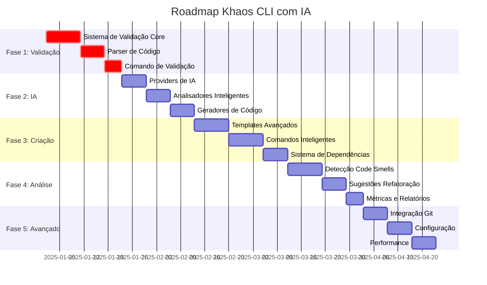

# 🧬 Planejamento Detalhado: Khaos CLI com IA

## 📋 Visão Geral do Projeto

O **Khaos CLI com IA** será uma ferramenta inteligente que automatiza a criação, validação e manutenção de código seguindo rigorosamente a arquitetura Khaos. O foco principal será garantir **conformidade absoluta** com as convenções estabelecidas.

## 🎯 Objetivos Principais

1. **Validação Rigorosa**: Sistema que garante 100% de conformidade com a arquitetura Khaos
2. **Criação Inteligente**: IA que analisa descrições e gera código apropriado para cada camada
3. **Detecção de Violações**: Identificação automática de code smells e violações arquiteturais
4. **Refatoração Assistida**: Sugestões inteligentes de melhorias baseadas nas boas práticas

---

## 🏗️ Arquitetura Técnica do CLI

### 📁 Estrutura de Pastas Proposta

```
khaos-cli/
├── src/
│   ├── core/                          # Core do sistema
│   │   ├── ai/                        # Integração com IA
│   │   │   ├── providers/             # OpenAI, Anthropic, etc.
│   │   │   ├── analyzers/             # Análise de código e descrições
│   │   │   └── generators/            # Geração de código inteligente
│   │   ├── validators/                # Sistema de validação
│   │   │   ├── layer-validators/      # Validadores por camada
│   │   │   ├── convention-validators/ # Validadores de convenções
│   │   │   └── architecture-validator.ts
│   │   ├── parsers/                   # Análise de código existente
│   │   └── utils/                     # Utilitários compartilhados
│   ├── commands/                      # Comandos CLI
│   │   ├── create/                    # Comandos de criação
│   │   ├── validate/                  # Comandos de validação
│   │   ├── refactor/                  # Comandos de refatoração
│   │   └── analyze/                   # Comandos de análise
│   ├── templates/                     # Templates por camada
│   │   ├── atoms/
│   │   ├── molecules/
│   │   ├── organisms/
│   │   ├── templates/
│   │   ├── features/
│   │   └── gateways/
│   ├── schemas/                       # Schemas de validação
│   │   ├── layer-schemas/
│   │   └── convention-schemas/
│   └── config/                        # Configurações
├── docs/                              # Documentação (existente)
├── tests/                             # Testes automatizados
└── examples/                          # Exemplos de uso
```

### 🛠️ Tecnologias e Bibliotecas

```json
{
  "dependencies": {
    "commander": "^12.0.0",           // CLI framework
    "inquirer": "^8.2.6",            // Interface interativa
    "ejs": "^3.1.10",                // Templates
    "fs-extra": "^11.3.0",           // Sistema de arquivos
    "openai": "^4.0.0",              // OpenAI API (também usado para OpenRouter)
    "@anthropic-ai/sdk": "^0.20.0",  // Anthropic API
    "zod": "^3.22.0",                // Validação de schemas
    "typescript": "^5.8.3",          // TypeScript
    "chalk": "^5.3.0",               // Cores no terminal
    "ora": "^7.0.1",                 // Loading spinners
    "glob": "^10.3.0",               // Pattern matching
    "ast-types": "^0.16.1",          // AST parsing
    "@typescript-eslint/parser": "^6.0.0", // TypeScript AST
    "prettier": "^3.0.0",            // Code formatting
    "@tanstack/react-query": "^5.0.0", // React Query para repositories
    "expo-router": "^3.0.0"          // Expo Router para file-system routing
  }
}
```

### 🌐 Providers de IA Suportados

1. **OpenAI**: Acesso direto aos modelos GPT-4 e GPT-3.5-turbo
2. **Anthropic**: Acesso direto aos modelos Claude 3 (Opus, Sonnet, Haiku)
3. **OpenRouter**: Acesso unificado a múltiplos modelos com preços competitivos
   - Modelos OpenAI: `openai/gpt-4`, `openai/gpt-4-turbo`
   - Modelos Anthropic: `anthropic/claude-3.5-sonnet`, `anthropic/claude-3-opus`
   - Modelos Meta: `meta-llama/llama-3.1-405b`, `meta-llama/llama-3.1-70b`
   - Modelos Google: `google/gemini-pro`, `google/gemini-flash`
   - Modelos especializados: `deepseek/deepseek-coder`, `codellama/codellama-70b`

---

## 📊 Fases de Desenvolvimento

### 🔥 **FASE 1: Fundação e Validação (Prioridade Máxima)**
*Duração estimada: 3-4 semanas*

#### 1.1 Sistema de Validação Core
- **Micro Tarefa 1.1.1**: Criar `src/core/validators/architecture-validator.ts` - Sistema central de validação
- **Micro Tarefa 1.1.2**: Implementar `src/core/validators/layer-validators/` - Validadores específicos por camada
- **Micro Tarefa 1.1.3**: Desenvolver `src/core/validators/convention-validators/` - Validadores de convenções gerais
- **Micro Tarefa 1.1.4**: Criar `src/schemas/` - Schemas Zod para cada camada

#### 1.2 Parser de Código Existente
- **Micro Tarefa 1.2.1**: Implementar `src/core/parsers/typescript-parser.ts` - Parser AST TypeScript
- **Micro Tarefa 1.2.2**: Criar `src/core/parsers/project-analyzer.ts` - Análise de estrutura de projeto
- **Micro Tarefa 1.2.3**: Desenvolver `src/core/parsers/dependency-analyzer.ts` - Análise de dependências

#### 1.3 Comando de Validação
- **Micro Tarefa 1.3.1**: Implementar `src/commands/validate/validate-project.ts`
- **Micro Tarefa 1.3.2**: Criar `src/commands/validate/validate-layer.ts`
- **Micro Tarefa 1.3.3**: Desenvolver relatórios detalhados de validação

**Critérios de Aceitação Fase 1:**
- ✅ Validação completa de todas as camadas da arquitetura Khaos
- ✅ Detecção de 100% das violações de convenções documentadas
- ✅ Relatórios detalhados com localização exata dos problemas
- ✅ Performance: validação de projeto médio em < 5 segundos

---

### 🤖 **FASE 2: Integração com IA**
*Duração estimada: 2-3 semanas*

#### 2.1 Providers de IA
- **Micro Tarefa 2.1.1**: Implementar `src/core/ai/providers/openai-provider.ts`
- **Micro Tarefa 2.1.2**: Implementar `src/core/ai/providers/anthropic-provider.ts`
- **Micro Tarefa 2.1.3**: Implementar `src/core/ai/providers/openrouter-provider.ts`
- **Micro Tarefa 2.1.4**: Criar `src/core/ai/providers/ai-provider-interface.ts`
- **Micro Tarefa 2.1.5**: Implementar `src/core/ai/providers/provider-factory.ts` com suporte aos 3 providers

#### 2.2 Analisadores Inteligentes
- **Micro Tarefa 2.2.1**: Desenvolver `src/core/ai/analyzers/description-analyzer.ts` - Análise de linguagem natural
- **Micro Tarefa 2.2.2**: Criar `src/core/ai/analyzers/layer-classifier.ts` - Classificação automática de camadas
- **Micro Tarefa 2.2.3**: Implementar `src/core/ai/analyzers/naming-analyzer.ts` - Sugestão de nomes

#### 2.3 Geradores de Código
- **Micro Tarefa 2.3.1**: Criar `src/core/ai/generators/code-generator.ts` - Geração inteligente de código
- **Micro Tarefa 2.3.2**: Implementar `src/core/ai/generators/template-selector.ts` - Seleção automática de templates

**Critérios de Aceitação Fase 2:**
- ✅ Classificação correta de camada em 95% dos casos
- ✅ Sugestões de nomes seguindo convenções em 100% dos casos
- ✅ Geração de código inicial válido conforme validadores da Fase 1
- ✅ Fallback gracioso quando IA não está disponível

---

### 🏗️ **FASE 3: Criação Inteligente de Componentes**
*Duração estimada: 4-5 semanas*

#### 3.1 Templates Avançados
- **Micro Tarefa 3.1.1**: Expandir templates para todas as camadas (molecules, organisms, templates, features, gateways)
- **Micro Tarefa 3.1.2**: Criar templates condicionais baseados em contexto
- **Micro Tarefa 3.1.3**: Implementar templates com dependências inteligentes
- **Micro Tarefa 3.1.4**: Criar templates para rotas automáticas (public/private)
- **Micro Tarefa 3.1.5**: Criar templates para layouts baseados em diretório

#### 3.2 Comandos de Criação Inteligente
- **Micro Tarefa 3.2.1**: Implementar `src/commands/create/smart-create.ts` - Criação com IA
- **Micro Tarefa 3.2.2**: Desenvolver `src/commands/create/layer-creators/` - Criadores específicos por camada
- **Micro Tarefa 3.2.3**: Criar fluxo interativo com validação em tempo real
- **Micro Tarefa 3.2.4**: Implementar criação automática de rotas para features
- **Micro Tarefa 3.2.5**: Implementar criação de layouts baseada em diretório

#### 3.3 Sistema de Layouts e Rotas Automáticas
- **Micro Tarefa 3.3.1**: Implementar `src/core/route-generator.ts` - Geração automática de rotas
- **Micro Tarefa 3.3.2**: Criar sistema de classificação de rotas (public/private)
- **Micro Tarefa 3.3.3**: Desenvolver validação de estrutura de rotas
- **Micro Tarefa 3.3.4**: Implementar conversão de caminhos para nomes de componentes
- **Micro Tarefa 3.3.5**: Implementar `src/core/layout-generator.ts` - Geração de layouts baseada em diretório
- **Micro Tarefa 3.3.6**: Criar sistema de validação para estrutura de diretórios de layouts

#### 3.4 Sistema de Dependências
- **Micro Tarefa 3.4.1**: Implementar `src/core/dependency-resolver.ts` - Resolução automática de dependências
- **Micro Tarefa 3.4.2**: Criar sistema de sugestão de imports
- **Micro Tarefa 3.4.3**: Desenvolver detecção de dependências circulares

**Critérios de Aceitação Fase 3:**
- ✅ Criação de qualquer camada com descrição em linguagem natural
- ✅ Código gerado passa 100% nas validações da Fase 1
- ✅ Resolução automática de dependências entre camadas
- ✅ Sugestão inteligente de estrutura de arquivos opcionais
- ✅ Geração automática de rotas ao criar features
- ✅ Classificação correta de rotas públicas vs privadas
- ✅ Estrutura de pastas `(app)/(private)` e `(app)/(public)` criada automaticamente
- ✅ Criação de layouts baseada em diretório especificado
- ✅ Validação de estrutura de diretórios para layouts
- ✅ Conversão correta de diretório para nome de layout

---

### 🔍 **FASE 4: Análise e Refatoração**
*Duração estimada: 3-4 semanas*

#### 4.1 Detecção de Code Smells
- **Micro Tarefa 4.1.1**: Implementar `src/commands/analyze/smell-detector.ts`
- **Micro Tarefa 4.1.2**: Criar detectores específicos para cada code smell documentado
- **Micro Tarefa 4.1.3**: Desenvolver sistema de scoring de qualidade

#### 4.2 Sugestões de Refatoração
- **Micro Tarefa 4.2.1**: Implementar `src/commands/refactor/refactor-suggestions.ts`
- **Micro Tarefa 4.2.2**: Criar sistema de aplicação automática de refatorações
- **Micro Tarefa 4.2.3**: Desenvolver preview de mudanças antes da aplicação

#### 4.3 Métricas e Relatórios
- **Micro Tarefa 4.3.1**: Criar `src/commands/analyze/metrics-generator.ts`
- **Micro Tarefa 4.3.2**: Implementar dashboard de saúde do projeto
- **Micro Tarefa 4.3.3**: Desenvolver relatórios de evolução da qualidade

**Critérios de Aceitação Fase 4:**
- ✅ Detecção de todos os code smells documentados
- ✅ Sugestões de refatoração com preview das mudanças
- ✅ Métricas de qualidade e conformidade arquitetural
- ✅ Relatórios exportáveis em múltiplos formatos

---

### 🚀 **FASE 5: Funcionalidades Avançadas**
*Duração estimada: 2-3 semanas*

#### 5.1 Integração com Git
- **Micro Tarefa 5.1.1**: Implementar hooks de pre-commit para validação
- **Micro Tarefa 5.1.2**: Criar sistema de commits automáticos seguindo Conventional Commits
- **Micro Tarefa 5.1.3**: Desenvolver análise de diff para mudanças arquiteturais

#### 5.2 Configuração e Personalização
- **Micro Tarefa 5.2.1**: Criar sistema de configuração `khaos.config.js`
- **Micro Tarefa 5.2.2**: Implementar templates customizáveis por projeto
- **Micro Tarefa 5.2.3**: Desenvolver plugins para extensibilidade

#### 5.3 Performance e Otimização
- **Micro Tarefa 5.3.1**: Implementar cache inteligente para validações
- **Micro Tarefa 5.3.2**: Otimizar parsing de projetos grandes
- **Micro Tarefa 5.3.3**: Criar modo watch para validação contínua

**Critérios de Aceitação Fase 5:**
- ✅ Integração completa com workflow Git
- ✅ Configuração flexível por projeto
- ✅ Performance otimizada para projetos grandes (1000+ arquivos)
- ✅ Sistema de plugins funcionando

---

## 🎯 Roadmap de Implementação



---

## 🔧 Padrões de Design

### 1. **Strategy Pattern** - Providers de IA
```typescript
interface AIProvider {
  analyzeDescription(description: string): Promise<LayerAnalysis>;
  generateCode(analysis: LayerAnalysis): Promise<string>;
}

class OpenAIProvider implements AIProvider {
  async analyzeDescription(description: string): Promise<LayerAnalysis> {
    // Implementação OpenAI
  }
}

class AnthropicProvider implements AIProvider {
  async analyzeDescription(description: string): Promise<LayerAnalysis> {
    // Implementação Anthropic
  }
}
```

### 2. **Chain of Responsibility** - Validadores
```typescript
abstract class Validator {
  protected next?: Validator;
  
  setNext(validator: Validator): Validator {
    this.next = validator;
    return validator;
  }
  
  abstract validate(code: string): ValidationResult;
  
  protected validateNext(code: string): ValidationResult {
    if (this.next) {
      return this.next.validate(code);
    }
    return { valid: true, errors: [] };
  }
}

class NamingValidator extends Validator {
  validate(code: string): ValidationResult {
    // Validação de nomenclatura
    const result = this.validateNaming(code);
    if (!result.valid) return result;
    return this.validateNext(code);
  }
}
```

### 3. **Factory Pattern** - Criação de Componentes
```typescript
class ComponentFactory {
  static create(layer: LayerType, config: ComponentConfig): Component {
    switch (layer) {
      case 'atom':
        return new AtomComponent(config);
      case 'molecule':
        return new MoleculeComponent(config);
      case 'organism':
        return new OrganismComponent(config);
      default:
        throw new Error(`Unsupported layer: ${layer}`);
    }
  }
}
```

### 4. **Observer Pattern** - Sistema de Eventos
```typescript
class ValidationEventEmitter {
  private listeners: Map<string, Function[]> = new Map();
  
  on(event: 'violation' | 'success' | 'warning', callback: Function): void {
    if (!this.listeners.has(event)) {
      this.listeners.set(event, []);
    }
    this.listeners.get(event)!.push(callback);
  }
  
  emit(event: string, data: any): void {
    const callbacks = this.listeners.get(event) || [];
    callbacks.forEach(callback => callback(data));
  }
}
```

---

## 📋 Especificações Técnicas Detalhadas

### 🔍 Sistema de Validação

#### Validadores por Camada

**Atom Validator:**
```typescript
interface AtomValidationRules {
  // Estrutura de arquivos
  requiredFiles: ['index.ts', '*.atom.tsx', '*.type.ts'];
  optionalFiles: ['*.constant.ts', '*.mock.ts', '*.spec.ts'];
  restrictedFiles: ['*.variant.ts', '*.stories.tsx', '*.use-case.ts', '*.service.ts'];
  
  // Convenções de nomenclatura
  fileNaming: 'dash-case';
  componentNaming: 'PascalCase';
  
  // Estrutura de código
  mustHaveTestID: true;
  mustExportFromIndex: true;
  mustUseNamespace: true;
  hasCompositionRoot: true; // Atoms têm composition root
  
  // Restrições de export
  exportRestrictions: ['*.variant.ts', '*.stories.tsx', '*.spec.ts']; // Não exportar no index.ts
}
```

**Molecule Validator:**
```typescript
interface MoleculeValidationRules extends AtomValidationRules {
  requiredFiles: ['index.ts', '*.molecule.tsx', '*.type.ts', '*.use-case.ts'];
  mustImportAtLeastOneAtom: true;
  mustImplementUseCase: true;
  restrictedFiles: ['partials/', 'mock.ts', 'scheme.ts', 'context.tsx'];
  hasCompositionRoot: true; // Molecules têm composition root
}

**Organism Validator:**
```typescript
interface OrganismValidationRules extends MoleculeValidationRules {
  requiredFiles: ['index.ts', '*.organism.tsx', '*.type.ts', '*.use-case.ts'];
  hasCompositionRoot: true; // Organisms têm composition root
  canMakeDirectAPICalls: true; // Organisms podem fazer chamadas diretas de API
}

**Template Validator:**
```typescript
interface TemplateValidationRules {
  requiredFiles: ['index.ts', '*.template.tsx', '*.type.ts'];
  hasCompositionRoot: true; // Templates têm composition root
  dependencyRestrictions: ['features']; // Templates não podem depender de Features
  allowedDependencies: ['atoms', 'molecules', 'organisms']; // Templates dependem de componentes
}

**Feature Validator:**
```typescript
interface FeatureValidationRules {
  requiredFiles: ['index.ts', '*.feature.tsx', '*.type.ts', '*.use-case.ts'];
  renderingRestriction: ['templates']; // Features renderizam exclusivamente templates
  hierarchyPosition: 'top'; // Features estão no topo da hierarquia
}

**Utils Validator:**
```typescript
interface UtilValidationRules {
  requiredFiles: ['*.util.ts'];
  characteristics: 'pure-functions-only';
  usageRestrictions: ['entity', 'gateway', 'repository', 'model']; // Utils não podem ser usados nessas camadas
}

**Layout Validator (Expo Router):**
```typescript
interface LayoutValidationRules {
  // Estrutura de arquivos
  requiredFiles: ['index.ts', '_layout.tsx', '*.type.ts'];
  optionalFiles: ['*.constant.ts', '*.spec.ts', '*.tsx'];
  restrictedFiles: ['*.stories.tsx', '*.variant.ts', '*.mock.ts', '*.use-case.ts', '_services/'];
  
  // Convenções Expo Router
  mustUseExpoRouter: true;
  mustHaveDefaultExport: true;
  validLayoutTypes: ['Stack', 'Tabs', 'Drawer'];
  
  // File-system routing
  fileSystemRouting: true;
  pagesMustExportFeatures: true;
}
```

#### Schema de Validação com Zod

```typescript
import { z } from 'zod';

export const AtomSchema = z.object({
  name: z.string().regex(/^[a-z]+(-[a-z]+)*$/, 'Must be dash-case'),
  files: z.object({
    'index.ts': z.string(),
    '*.atom.tsx': z.string(),
    '*.type.ts': z.string(),
    '*.constant.ts': z.string().optional(),
    '*.mock.ts': z.string().optional(),
    '*.spec.ts': z.string().optional(),
  }),
  structure: z.object({
    hasTestID: z.boolean(),
    exportsFromIndex: z.boolean(),
    usesNamespace: z.boolean(),
    hasCompositionRoot: z.boolean(), // Atoms têm composition root
  }),
  restrictions: z.object({
    noVariantExport: z.boolean(), // variant.ts não exportado no index.ts
    noStoriesExport: z.boolean(), // stories.tsx não exportado no index.ts
    noSpecExport: z.boolean(), // spec.ts não exportado no index.ts
  }),
});

export const OrganismSchema = z.object({
  name: z.string().regex(/^[a-z]+(-[a-z]+)*$/, 'Must be dash-case'),
  files: z.object({
    'index.ts': z.string(),
    '*.organism.tsx': z.string(),
    '*.type.ts': z.string(),
    '*.use-case.ts': z.string(),
  }),
  structure: z.object({
    hasTestID: z.boolean(),
    exportsFromIndex: z.boolean(),
    usesNamespace: z.boolean(),
    hasCompositionRoot: z.boolean(), // Organisms têm composition root
    canMakeDirectAPICalls: z.boolean(), // Organisms podem fazer chamadas diretas de API
  }),
});

export const TemplateSchema = z.object({
  name: z.string().regex(/^[a-z]+(-[a-z]+)*$/, 'Must be dash-case'),
  files: z.object({
    'index.ts': z.string(),
    '*.template.tsx': z.string(),
    '*.type.ts': z.string(),
  }),
  structure: z.object({
    hasTestID: z.boolean(),
    exportsFromIndex: z.boolean(),
    usesNamespace: z.boolean(),
    hasCompositionRoot: z.boolean(), // Templates têm composition root
  }),
  dependencies: z.object({
    canDependOn: z.array(z.enum(['atom', 'molecule', 'organism'])),
    cannotDependOn: z.array(z.enum(['feature'])), // Templates não dependem de Features
  }),
});

export const FeatureSchema = z.object({
  name: z.string().regex(/^[a-z]+(-[a-z]+)*$/, 'Must be dash-case'),
  files: z.object({
    'index.ts': z.string(),
    '*.feature.tsx': z.string(),
    '*.type.ts': z.string(),
    '*.use-case.ts': z.string(),
  }),
  structure: z.object({
    hasTestID: z.boolean(),
    exportsFromIndex: z.boolean(),
    usesNamespace: z.boolean(),
    renderExclusively: z.array(z.enum(['template'])), // Features renderizam exclusivamente templates
  }),
  hierarchy: z.object({
    isTopLevel: z.boolean(), // Features estão no topo da hierarquia
    dependsOn: z.array(z.enum(['template'])),
  }),
});

export const UtilSchema = z.object({
  name: z.string().regex(/^[a-z]+(-[a-z]+)*$/, 'Must be dash-case'),
  files: z.object({
    '*.util.ts': z.string(),
  }),
  structure: z.object({
    isPureFunction: z.boolean(),
    hasNoSideEffects: z.boolean(),
  }),
  restrictions: z.object({
    cannotBeUsedIn: z.array(z.enum(['entity', 'gateway', 'repository', 'model'])), // Utils não podem ser usados nessas camadas
  }),
});
```

### 🤖 Sistema de IA

#### Análise de Descrições

```typescript
interface DescriptionAnalysis {
  intent: string;                    // "criar um botão reutilizável"
  suggestedLayer: LayerType;         // "atom"
  confidence: number;                // 0.95
  suggestedName: string;             // "button"
  requiredFeatures: string[];        // ["clickable", "styled"]
  optionalFeatures: string[];        // ["variants", "icons"]
  dependencies: string[];            // ["react", "react-native"]
}

class DescriptionAnalyzer {
  async analyze(description: string): Promise<DescriptionAnalysis> {
    const prompt = this.buildAnalysisPrompt(description);
    const response = await this.aiProvider.complete(prompt);
    return this.parseResponse(response);
  }
  
  private buildAnalysisPrompt(description: string): string {
    return `
    Analise a seguinte descrição e determine:
    1. Qual camada da arquitetura Khaos é mais apropriada
    2. Nome sugerido seguindo dash-case
    3. Funcionalidades necessárias
    
    Descrição: "${description}"
    
    Camadas disponíveis:
    - atom: Elementos básicos reutilizáveis
    - molecule: Combinação de átomos
    - organism: Composições complexas
    - template: Layouts visuais
    - feature: Funcionalidades completas
    - gateway: Acesso a APIs
    
    Responda em JSON:
    `;
  }
}
```

#### Geração de Código

```typescript
class CodeGenerator {
  async generateComponent(analysis: DescriptionAnalysis): Promise<GeneratedCode> {
    const template = await this.selectTemplate(analysis);
    const variables = this.extractVariables(analysis);
    const code = await this.renderTemplate(template, variables);
    
    // Validação automática do código gerado
    const validation = await this.validator.validate(code);
    if (!validation.valid) {
      throw new Error(`Generated code is invalid: ${validation.errors.join(', ')}`);
    }
    
    return {
      files: code,
      validation,
      metadata: {
        layer: analysis.suggestedLayer,
        name: analysis.suggestedName,
        generatedAt: new Date(),
      }
    };
  }

  /**
   * Geração específica para features com rotas automáticas
   */
  async generateFeatureWithRoute(analysis: DescriptionAnalysis): Promise<GeneratedCode> {
    const routePath = analysis.routePath; // "strategy/investors"
    const featureName = this.routePathToFeatureName(routePath); // "strategy-investors"
    const componentName = this.routePathToComponentName(routePath); // "StrategyInvestorsFeature"
    const routeType = analysis.routeType || 'private'; // "private" | "public"
    
    // Gerar feature
    const featureFiles = await this.generateFeature(featureName, analysis);
    
    // Gerar rota automática
    const routeFile = this.generateRouteFile(routePath, featureName, componentName, routeType);
    
    return {
      files: {
        ...featureFiles.files,
        [`src/app/(app)/(${routeType})/${routePath}.tsx`]: routeFile,
      },
      validation: { valid: true, errors: [] },
      metadata: {
        layer: 'feature',
        name: featureName,
        routePath,
        routeType,
        componentName,
        hasAutoRoute: true,
        generatedAt: new Date(),
      }
    };
  }

  /**
   * Geração de arquivo de rota automática
   */
  private generateRouteFile(routePath: string, featureName: string, componentName: string, routeType: string): string {
    return `// Auto-generated route for ${componentName}
// Route: /${routePath} (${routeType})
export { ${componentName} as default } from '@/features/${featureName}';
`;
  }

  /**
   * Conversão de caminho de rota para nome de feature
   */
  private routePathToFeatureName(routePath: string): string {
    return routePath.replace(/\//g, '-'); // "strategy/investors" → "strategy-investors"
  }

  /**
   * Conversão de caminho de rota para nome de componente
   */
  private routePathToComponentName(routePath: string): string {
    return routePath
      .split('/')
      .map(part => this.toPascalCase(part))
      .join('') + 'Feature'; // "strategy/investors" → "StrategyInvestorsFeature"
  }

  /**
   * Geração específica para layouts baseados em diretório
   */
  async generateLayout(analysis: DescriptionAnalysis): Promise<GeneratedCode> {
    const directoryPath = analysis.directoryPath; // "(app)/(private)/strategy"
    const layoutName = this.directoryPathToLayoutName(directoryPath); // "strategy"
    const pascalName = this.toPascalCase(layoutName); // "Strategy"
    const layoutType = analysis.layoutType || 'Stack'; // Stack, Tabs, Drawer
    
    const layoutCode = `
import { ${layoutType} } from 'expo-router${layoutType === 'Drawer' ? '/drawer' : ''}';
import { FC } from 'react';
import { N${pascalName}Layout } from './${layoutName}.type';
${layoutType === 'Tabs' || layoutType === 'Drawer' ? "import { Ionicons } from '@expo/vector-icons';" : ''}

export const ${pascalName}Layout: FC<N${pascalName}Layout.Props> = ({ testID, children }) => {
  return (
    <${layoutType}
      testID={\`\${testID}-${layoutType.toLowerCase()}-layout\`}
      screenOptions={{
        ${this.generateScreenOptions(layoutType)}
      }}
    >
      ${this.generateScreens(layoutName, layoutType)}
      {children}
    </${layoutType}>
  );
};

export default ${pascalName}Layout;
`;

    const typeCode = `
import type { ReactNode } from 'react';

export namespace N${pascalName}Layout {
  export type Props = TWithTestID & {
    children: ReactNode;
  };

  ${this.generateLayoutTypeOptions(layoutType)}
}
`;

    const constantCode = `
export const ${layoutName.toUpperCase()}_${layoutType.toUpperCase()}_OPTIONS = {
  DEFAULT: {
    ${this.generateDefaultOptions(layoutType)}
  },
} as const;
`;

    return {
      files: {
        [`${directoryPath}/_layout.tsx`]: layoutCode,
        [`${directoryPath}/${layoutName}.type.ts`]: typeCode,
        [`${directoryPath}/${layoutName}.constant.ts`]: constantCode,
        [`${directoryPath}/index.ts`]: `export * from './_layout';\nexport * from './${layoutName}.type';\nexport * from './${layoutName}.constant';`,
      },
      validation: { valid: true, errors: [] },
      metadata: {
        layer: 'layout',
        name: layoutName,
        directoryPath,
        layoutType,
        usesExpoRouter: true,
        directoryBased: true,
        generatedAt: new Date(),
      }
    };
  }

  /**
   * Conversão de caminho de diretório para nome de layout
   */
  private directoryPathToLayoutName(directoryPath: string): string {
    // "(app)/(private)/strategy" → "strategy"
    // "(app)/(public)/auth" → "auth"
    // "(app)/(private)/dashboard/settings" → "settings"
    const parts = directoryPath.split('/');
    return parts[parts.length - 1].replace(/[()]/g, '');
  }

  /**
   * Geração específica para repositories com React Query
   */
  async generateRepository(analysis: DescriptionAnalysis): Promise<GeneratedCode> {
    const entityName = analysis.suggestedName;
    const pascalName = this.toPascalCase(entityName);
    
    const repositoryCode = `
import { useQuery, useSuspenseQuery, useMutation, useQueryClient } from '@tanstack/react-query';
import { ${pascalName}Model, type TProcessed${pascalName} } from '@/models/${entityName}.model';
import { findMany${pascalName}sGateway } from '@/gateways/find-many-${entityName}s.gateway';
import { findOne${pascalName}Gateway } from '@/gateways/find-one-${entityName}.gateway';
import { create${pascalName}Gateway } from '@/gateways/create-${entityName}.gateway';
import { update${pascalName}Gateway } from '@/gateways/update-${entityName}.gateway';
import { delete${pascalName}Gateway } from '@/gateways/delete-${entityName}.gateway';

export const ${entityName}Keys = {
  all: ['${entityName}'] as const,
  lists: () => [...${entityName}Keys.all, 'list'] as const,
  list: (filters?) => [...${entityName}Keys.lists(), filters] as const,
  details: () => [...${entityName}Keys.all, 'detail'] as const,
  detail: (id: string) => [...${entityName}Keys.details(), id] as const,
} as const;

export const use${pascalName}Repository = () => {
  const queryClient = useQueryClient();

  const useFindMany = (filters?, options?) => {
    return useQuery({
      queryKey: ${entityName}Keys.list(filters),
      queryFn: async () => {
        const response = await findMany${pascalName}sGateway(filters);
        return ${pascalName}Model.fromEntities(response.data);
      },
      enabled: options?.enabled ?? true,
      staleTime: 5 * 60 * 1000,
    });
  };

  const useFindOne = (id: string, options?) => {
    return useQuery({
      queryKey: ${entityName}Keys.detail(id),
      queryFn: async () => {
        const entity = await findOne${pascalName}Gateway(id);
        return ${pascalName}Model.fromEntity(entity);
      },
      enabled: (options?.enabled ?? true) && !!id,
      staleTime: 10 * 60 * 1000,
    });
  };

  const useCreate = () => {
    return useMutation({
      mutationFn: async (data) => {
        const entity = await create${pascalName}Gateway(data);
        return ${pascalName}Model.fromEntity(entity);
      },
      onSuccess: () => {
        queryClient.invalidateQueries({ queryKey: ${entityName}Keys.lists() });
      },
    });
  };

  const useUpdate = () => {
    return useMutation({
      mutationFn: async ({ id, data }) => {
        const entity = await update${pascalName}Gateway(id, data);
        return ${pascalName}Model.fromEntity(entity);
      },
      onSuccess: (updated, { id }) => {
        queryClient.setQueryData(${entityName}Keys.detail(id), updated);
        queryClient.invalidateQueries({ queryKey: ${entityName}Keys.lists() });
      },
    });
  };

  const useRemove = () => {
    return useMutation({
      mutationFn: async (id: string) => {
        await delete${pascalName}Gateway(id);
      },
      onSuccess: (_, id) => {
        queryClient.removeQueries({ queryKey: ${entityName}Keys.detail(id) });
        queryClient.invalidateQueries({ queryKey: ${entityName}Keys.lists() });
      },
    });
  };

  return {
    useFindMany,
    useFindOne,
    useCreate,
    useUpdate,
    useRemove,
    keys: ${entityName}Keys,
  };
};
`;

    return {
      files: {
        [`${entityName}.repository.ts`]: repositoryCode,
      },
      validation: { valid: true, errors: [] },
      metadata: {
        layer: 'repository',
        name: entityName,
        generatedAt: new Date(),
        usesReactQuery: true,
      }
    };
  }
}
```

### 📊 Sistema de Métricas

```typescript
interface ProjectMetrics {
  conformity: {
    overall: number;              // 0.95 (95% conforme)
    byLayer: Record<LayerType, number>;
    violations: ViolationReport[];
  };
  
  quality: {
    codeSmells: number;
    duplicatedCode: number;
    testCoverage: number;
    maintainabilityIndex: number;
  };
  
  architecture: {
    layerDistribution: Record<LayerType, number>;
    dependencyGraph: DependencyNode[];
    circularDependencies: string[];
  };
  
  evolution: {
    trend: 'improving' | 'degrading' | 'stable';
    history: MetricSnapshot[];
  };
}
```

---

## 📋 Critérios de Aceitação Globais

### ✅ **Conformidade Arquitetural**
- [ ] 100% das convenções de nomenclatura validadas
  - Arquivos em dash-case
  - Componentes em PascalCase
  - Variáveis em camelCase
  - Constantes em UPPER_CASE
- [ ] Estrutura de pastas rigorosamente seguida
  - Camadas em diretórios corretos
  - Arquivos obrigatórios presentes
  - Arquivos restritos ausentes
- [ ] Imports e exports conforme especificação
  - Exports centralizados em index.ts
  - Imports relativos corretos
  - Sem exports default
- [ ] Tipos e interfaces seguindo padrões
  - Namespaces para agrupamento
  - Props com testID obrigatório
  - Entidades com prefixo T

### ✅ **Qualidade do Código Gerado**
- [ ] Código TypeScript válido e compilável
  - Sem erros de compilação
  - Tipos corretos
  - Imports resolvidos
- [ ] Seguindo todas as boas práticas documentadas
  - Early return
  - Funções pequenas e focadas
  - Nomes descritivos
  - Separação de responsabilidades
- [ ] Sem code smells detectáveis
  - Sem código duplicado
  - Sem funções longas
  - Sem acoplamento excessivo
  - Sem lógica acoplada à UI
- [ ] Testes unitários quando aplicável
  - Cobertura mínima de 80%
  - Testes positivos e negativos
  - Uso de mocks apropriados

### ✅ **Experiência do Usuário**
- [ ] Interface CLI intuitiva e responsiva
  - Comandos claros e consistentes
  - Feedback imediato
  - Navegação intuitiva
- [ ] Mensagens de erro claras e acionáveis
  - Localização exata do problema
  - Sugestões de correção
  - Exemplos de uso correto
- [ ] Feedback visual durante operações longas
  - Progress bars
  - Spinners
  - Estimativas de tempo
- [ ] Documentação completa e exemplos
  - Help contextual
  - Exemplos práticos
  - Troubleshooting

### ✅ **Performance e Confiabilidade**
- [ ] Validação de projetos grandes < 10 segundos
  - Cache inteligente
  - Processamento paralelo
  - Otimização de I/O
- [ ] Geração de código < 3 segundos
  - Templates pré-compilados
  - Geração incremental
  - Cache de IA
- [ ] Taxa de erro < 1% em operações normais
  - Tratamento robusto de erros
  - Recuperação automática
  - Logs detalhados
- [ ] Recuperação graceful de falhas de IA
  - Fallback para templates estáticos
  - Modo offline
  - Retry automático

---

## 🧪 Estratégia de Testes

### **Testes Unitários**
```typescript
// Exemplo: Teste de validador
describe('AtomValidator', () => {
  it('should validate correct atom structure', () => {
    const validator = new AtomValidator();
    const result = validator.validate(validAtomCode);
    expect(result.valid).toBe(true);
  });
  
  it('should detect missing testID', () => {
    const validator = new AtomValidator();
    const result = validator.validate(atomWithoutTestID);
    expect(result.valid).toBe(false);
    expect(result.errors).toContain('Props must include testID');
  });
});
```

### **Testes de Integração**
```typescript
// Exemplo: Teste de fluxo completo
describe('Smart Create Flow', () => {
  it('should create valid atom from description', async () => {
    const cli = new KhaosCLI();
    const result = await cli.smartCreate({
      description: 'um botão reutilizável',
      layer: 'atom'
    });
    
    expect(result.success).toBe(true);
    expect(result.files).toHaveProperty('button.atom.tsx');
    
    // Validar código gerado
    const validation = await validator.validateGenerated(result.files);
    expect(validation.valid).toBe(true);
  });
});
```

### **Testes de Conformidade**
```typescript
// Exemplo: Teste de conformidade com documentação
describe('Documentation Conformity', () => {
  it('should generate code matching atom.md examples', () => {
    const examples = loadExamplesFromDocs('atom.md');
    examples.forEach(example => {
      const generated = generator.generate(example.input);
      expect(generated).toMatchStructure(example.expected);
    });
  });
});
```

---

## 🚀 Comandos CLI Propostos

### Modo Interativo vs Linha de Comando

O CLI oferece duas formas de uso para máxima flexibilidade:

#### 🔄 Modo Interativo (Padrão)
Quando executado sem parâmetros completos, entra em modo interativo:

```bash
# Criação interativa de átomo
khaos create atom
? Qual é o nome do átomo? Button
? Tipo do átomo: Component, Constant, Type ou Util? component
? Incluir arquivos de teste? sim
? Adicionar Storybook stories? sim
? Incluir arquivo de constantes? sim
? Incluir arquivo de variantes (CVA)? sim
? Incluir arquivo de mock? sim
✅ Átomo Button criado com sucesso!

# Criação interativa de feature
khaos create feature
? Qual é o nome de sua feature? strategy/investors
? Esta página é pública ou autenticada? private
? Posso criar o template também? sim
? Precisa de layout específico? não
✅ Feature strategy/investors criada com sucesso!

# Criação interativa de layout
khaos create layout
? Qual diretório para o layout? (app)/(private)/strategy
? Tipo de layout: Stack, Tabs ou Drawer? stack
? Incluir componentes de navegação? sim
? Adicionar sidebar? não
✅ Layout criado em (app)/(private)/strategy!
```

#### ⚡ Modo Linha de Comando (Avançado)
Para usuários experientes que preferem comandos completos:

```bash
# Criação inteligente
khaos create --smart "um botão reutilizável"
khaos create atom button --type=component --with-tests --with-stories --with-constants --with-variants --with-mocks
khaos create molecule modal --with-atoms=button,icon

# Criação de features com rotas automáticas
khaos create feature strategy/investors --route-type=private --with-template
khaos create feature auth/login --route-type=public
khaos create feature dashboard/overview --route-type=private --route-path=dashboard/overview

# Criação de layouts
khaos create layout (app)/(private)/strategy --type=stack --with-navigation
khaos create layout (app)/(public)/auth --type=tabs

# Validação
khaos validate                    # Projeto completo
khaos validate --layer=atoms     # Camada específica
khaos validate --file=src/atoms/button/
khaos validate --routes          # Validar estrutura de rotas

# Análise
khaos analyze --smells           # Detectar code smells
khaos analyze --metrics          # Métricas de qualidade
khaos analyze --dependencies     # Análise de dependências
khaos analyze --routes           # Análise de estrutura de rotas

# Refatoração
khaos refactor --suggest         # Sugestões de melhorias
khaos refactor --apply           # Aplicar refatorações
khaos refactor --preview         # Preview das mudanças

# Configuração de IA
khaos init                       # Inicializar projeto
khaos config ai --provider=openai
khaos config ai --provider=anthropic
khaos config ai --provider=openrouter

# Configuração específica do OpenRouter
khaos config ai --openrouter-key=sk-or-v1-...
khaos config ai --openrouter-model=anthropic/claude-3.5-sonnet
khaos config ai --openrouter-fallback="openai/gpt-4,meta-llama/llama-3.1-70b"
khaos config ai --list-openrouter-models
khaos config ai --compare-pricing

# Templates e outras configurações
khaos config --templates=custom
```

### Flags e Opções
```bash
# Flags globais
--verbose, -v                    # Output detalhado
--quiet, -q                      # Output mínimo
--dry-run                        # Simular sem executar
--config=path                    # Arquivo de configuração customizado

# Flags específicas
--with-tests                     # Incluir testes
--with-stories                   # Incluir Storybook
--with-mocks                     # Incluir mocks
--type=stack|tabs|drawer         # Tipo de layout (para layouts)
--route-type=public|private      # Tipo de rota para features
--route-path=strategy/investors  # Caminho da rota no app
--with-expo-router               # Usar padrões Expo Router
--ai-provider=openai|anthropic   # Provider de IA
--template=custom                # Template customizado
```

### Fluxo de Criação Automática de Rotas

#### Exemplo Completo: Criando Feature com Rota
```bash
# Comando para Feature
khaos create feature strategy/investors --route-type=private

# Output do CLI
✨ Criando feature strategy/investors...
📁 Estrutura de feature: src/features/strategy-investors/
🛣️  Rota automática: src/app/(app)/(private)/strategy/investors.tsx
🧩 Componente: StrategyInvestorsFeature

📋 Arquivos criados:
├── src/features/strategy-investors/
│   ├── index.ts
│   ├── strategy-investors.feature.tsx
│   ├── strategy-investors.types.ts
│   ├── strategy-investors.use-case.ts
│   └── _repositories/
│       └── strategy-investors.repository.ts
└── src/app/(app)/(private)/strategy/investors.tsx

✅ Feature criada com sucesso!
✅ Rota privada configurada em /strategy/investors
🔄 Executando validação automática...
✅ Todos os arquivos passaram na validação

📝 Próximos passos:
1. Implementar lógica de negócio em strategy-investors.use-case.ts
2. Configurar repository em strategy-investors.repository.ts
3. Personalizar interface em strategy-investors.feature.tsx

💡 Dica: Use 'khaos validate --file=src/features/strategy-investors' para validar a implementação
```

#### Exemplo Completo: Criando Layout Baseado em Diretório
```bash
# Comando
khaos create layout (app)/(private)/strategy --type=stack

# Output do CLI
✨ Criando layout para diretório (app)/(private)/strategy...
📁 Diretório especificado: (app)/(private)/strategy
🏗️  Tipo de layout: Stack
📄 Arquivo principal: src/app/(app)/(private)/strategy/_layout.tsx

📋 Arquivos criados:
├── src/app/(app)/(private)/strategy/
│   ├── _layout.tsx              # Layout Stack principal
│   ├── strategy.type.ts         # Tipos para navegação
│   ├── strategy.constant.ts     # Constantes de navegação
│   └── index.ts                 # Re-exports

✅ Layout criado com sucesso!
✅ Layout Stack configurado para /strategy
🔄 Executando validação automática...
✅ Todos os arquivos passaram na validação

📝 Próximos passos:
1. Configurar screens no _layout.tsx
2. Criar rotas filhas (index.tsx, investors.tsx, etc.)
3. Personalizar opções de navegação em strategy.constant.ts

💡 Dica: Use 'khaos validate --file=src/app/(app)/(private)/strategy' para validar a implementação
```

#### Validações Automáticas para Rotas e Layouts
```typescript
interface RouteValidationRules {
  // Estrutura de rotas
  routeStructure: {
    privateRoutes: 'src/app/(app)/(private)/**/*.tsx';
    publicRoutes: 'src/app/(app)/(public)/**/*.tsx';
    mustExportFeature: true;
    mustHaveDefaultExport: true;
  };
  
  // Nomenclatura
  naming: {
    routePath: 'dash-case';           // strategy/investors
    featureName: 'dash-case';         // strategy-investors
    componentName: 'PascalCase';      // StrategyInvestorsFeature
  };
  
  // Correspondência
  correspondence: {
    routeToFeature: true;             // Rota deve corresponder à feature
    featureToComponent: true;         // Feature deve ter componente correspondente
    pathConversion: true;             // Conversão correta de / para -
  };
}

interface LayoutValidationRules {
  // Estrutura de layouts
  layoutStructure: {
    directoryBased: true;             // Layouts baseados em diretório
    mustHaveLayoutFile: '_layout.tsx';
    validDirectoryPaths: ['(app)/(private)/**', '(app)/(public)/**'];
    mustUseExpoRouter: true;
  };
  
  // Nomenclatura
  naming: {
    directoryPath: 'dash-case';       // (app)/(private)/strategy
    layoutName: 'dash-case';          // strategy
    componentName: 'PascalCase';      // StrategyLayout
  };
  
  // Validações específicas
  validation: {
    pathToLayoutGeneration: true;     // Diretório → _layout.tsx
    typeAfterDirectory: true;         // Tipo perguntado após diretório
    expoRouterCompliance: true;       // Conformidade com Expo Router
  };
}
```

---

Este planejamento detalhado fornece uma base sólida para o desenvolvimento do Khaos CLI com IA, priorizando a validação e conformidade arquitetural conforme solicitado. Cada fase tem objetivos claros, critérios mensuráveis e dependências bem definidas.