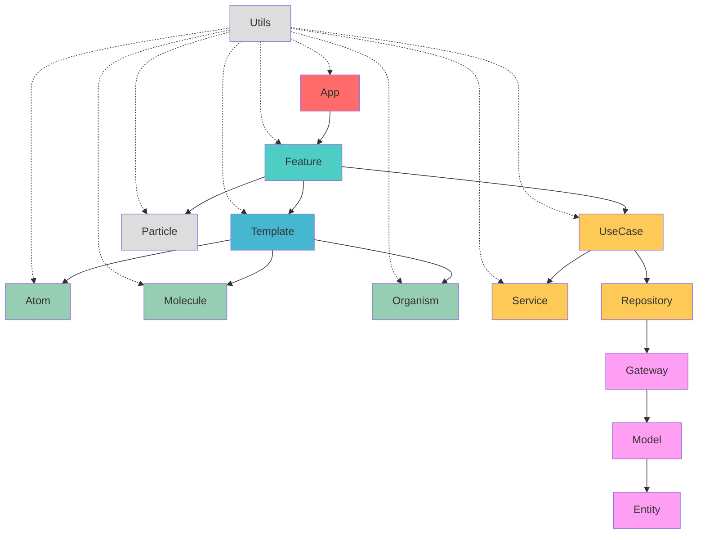

# Síntese das 12 Camadas - Regras e Estrutura

## 1. Atoms
**Responsabilidade:** Componentes básicos e indivisíveis da interface  
**Sufixo:** `.atom.tsx`  
**Arquivos permitidos:**
- `{name}.atom.tsx` (obrigatório)
- `{name}.type.ts`
- `{name}.constant.ts` (opcional)
- `{name}.variant.ts` (opcional)
- `{name}.mock.ts` (opcional)
- `{name}.stories.tsx`
- `{name}.spec.ts`
- `index.ts` (re-export)

**Restrições:**
- ❌ Não pode importar outros componentes React
- ❌ Não pode ter estado interno complexo
- ❌ Não pode fazer chamadas de API
- ❌ Nunca exportar `variant.ts`, `stories.tsx` e `spec.ts` no `index.ts`

**Dependências:** Apenas Utils e bibliotecas externas  
**Convenções:** Props tipadas com `TWithTestID`, componentes puros, namespace obrigatório

---

## 2. Molecules
**Responsabilidade:** Combinação de 2+ Atoms para formar componentes funcionais  
**Sufixo:** `.molecule.tsx`  
**Arquivos permitidos:**
- `{name}.molecule.tsx` (obrigatório)
- `{name}.type.ts`
- `{name}.constant.ts` (opcional)
- `{name}.variant.ts` (opcional)
- `{name}.mock.ts` (opcional)
- `{name}.stories.tsx`
- `{name}.spec.ts`
- `{name}.use-case.ts` (obrigatório)
- `_services/{service-name}.service.ts` (opcional)
- `index.ts` (re-export)

**Restrições:**
- ❌ Não pode importar Molecules, Organisms ou camadas superiores
- ❌ Não pode fazer chamadas diretas de API
- ❌ Não pode ter lógica de negócio complexa
- ❌ Services não podem ser importados diretamente no componente

**Dependências:** Atoms, Utils  
**Convenções:** Deve importar ao menos um átomo, use-case obrigatório, namespace obrigatório

---

## 3. Organisms
**Responsabilidade:** Seções complexas da interface combinando Molecules e Atoms  
**Sufixo:** `.organism.tsx`  
**Arquivos permitidos:**
- `{name}.organism.tsx` (obrigatório)
- `{name}.type.ts`
- `{name}.constant.ts` (opcional)
- `{name}.variant.ts` (opcional)
- `{name}.mock.ts` (opcional)
- `{name}.stories.tsx`
- `{name}.spec.ts`
- `{name}.use-case.ts` (obrigatório)
- `_partial/{name}.partial.tsx` (átomos exclusivos)
- `_services/{service-name}.service.ts` (opcional)
- `index.ts` (re-export)

**Restrições:**
- ❌ Não pode importar outros Organisms, Templates ou camadas superiores
- ❌ Não pode ter lógica de roteamento
- ❌ Nunca exportar `_partial` no `index.ts`

**Dependências:** Atoms, Molecules, Utils  
**Convenções:** Use-case obrigatório, tipos de `_partial` no `.type.ts`, namespace obrigatório

---

## 4. Templates
**Responsabilidade:** Estruturas de página sem dados específicos  
**Sufixo:** `.template.tsx`  
**Arquivos permitidos:**
- `{name}.template.tsx` (obrigatório)
- `{name}.types.ts`
- `_partials/{name}.partial.tsx` (opcional)
- `index.ts` (re-export)

**Restrições:**
- ❌ Não pode ter dados específicos ou estado de negócio
- ❌ Não pode fazer chamadas de API
- ❌ Não pode usar hooks (useEffect, useMemo, etc)
- ❌ Não pode usar ReactNode como prop (exceto children)
- ❌ Não pode ter arquivos: variant.ts, mock.ts, spec.ts, stories.tsx

**Dependências:** Atoms, Molecules, Organisms (não Features), Utils
**Convenções:** Apenas tipos primitivos, composition root permitido, namespace obrigatório

---

## 5. Features
**Responsabilidade:** Funcionalidades completas com lógica de negócio  
**Sufixo:** `.feature.tsx`  
**Arquivos permitidos:**
- `{name}.feature.tsx` (obrigatório)
- `{name}.types.ts`
- `{name}.use-case.ts` (obrigatório)
- `repository/{name}.repository.ts` (obrigatório)
- `_services/{service-name}.service.ts` (opcional)
- `index.ts` (re-export)

**Restrições:**
- ❌ Não pode importar outras Features ou Layouts
- ❌ Não pode ter lógica de roteamento global
- ❌ Não pode usar JSX/HTML direto (View, Text, etc)
- ❌ Não pode renderizar átomos, moléculas ou organismos diretamente. Renderiza exclusivamente template.
- ❌ Não pode ter mock, story, spec, variant

**Dependências:** Templates (obrigatório), Models, Entities, Utils, Gateways, Repositories  
**Convenções:** Deve usar Template, repository obrigatório, namespace obrigatório

---

## 6. Layouts
**Responsabilidade:** Estruturas de navegação com Expo Router  
**Sufixo:** `_layout.tsx` (padrão Expo Router)  
**Arquivos permitidos:**
- `_layout.tsx` (obrigatório)
- `{directory-name}.type.ts` (opcional)
- `{directory-name}.constant.ts` (opcional)
- `{directory-name}.spec.ts` (opcional)
- `index.ts` (re-export opcional)

**Restrições:**
- ❌ Não pode ter arquivos: stories.tsx, variant.ts, mock.ts, use-case.ts, _services/

**Dependências:** Atoms, Molecules, Organisms, Templates, Features, Utils  
**Convenções:** Seguir padrão Expo Router, apenas configuração de navegação, namespace obrigatório

---

## 7. Particles
**Responsabilidade:** Serviços, constantes e contextos compartilháveis  
**Sufixo:** `.particle.tsx`  
**Arquivos permitidos:**
- `{name}.particle.tsx` (obrigatório)
- `{name}.type.ts`
- `{name}.context.tsx` (opcional)
- `{name}.constant.ts` (opcional)
- `{name}.mock.ts` (opcional)
- `{name}.stories.tsx`
- `{name}.spec.ts`
- `_services/{service-name}.service.ts` (opcional)
- `index.ts` (re-export)

**Restrições:**
- ❌ Não pode ter elementos gráficos no contexto (apenas providers)
- ❌ Não pode ter dependências de outras camadas exceto Utils
- ❌ Não pode ter lógica específica de uma única feature

**Dependências:** Apenas Utils  
**Convenções:** Stateless quando possível, providers sem elementos visuais, namespace obrigatório

---

## 8. Models
**Responsabilidade:** Classes que encapsulam regras de negócio e transformações  
**Sufixo:** `.model.ts`  
**Arquivos permitidos:**
- `{name}.model.ts` (obrigatório)
- `{name}.model.spec.ts`

**Restrições:**
- ❌ Não pode fazer chamadas para APIs ou serviços externos
- ❌ Não pode conter lógica de UI ou apresentação
- ❌ Não pode gerenciar estado de componentes
- ❌ Não pode ter efeitos colaterais (side effects)
- ❌ Não pode acessar localStorage ou APIs do browser

**Dependências:** Entities, Utils  
**Convenções:** Classes com métodos estáticos, transformação de entities, validação com Zod

---

## 9. Entities
**Responsabilidade:** Representações puras dos dados da API  
**Sufixo:** `.entity.ts`  
**Arquivos permitidos:**
- `{name}.entity.ts` (obrigatório)
- `{name}.entity.spec.ts` (opcional)

**Restrições:**
- ❌ Não pode conter lógica de transformação ou validação
- ❌ Não pode ter métodos ou funções
- ❌ Não pode fazer transformações de nomenclatura
- ❌ Não pode incluir campos calculados que não vêm da API
- ❌ Não pode ter dependências de outras camadas

**Dependências:** Nenhuma  
**Convenções:** Apenas tipos TypeScript, nomenclatura com prefixo `T`, manter snake_case da API

---

## 10. Utils
**Responsabilidade:** Funções utilitárias puras e helpers gerais  
**Sufixo:** `.util.ts`  
**Arquivos permitidos:**
- `{name}.util.ts` (obrigatório)
- `{name}.util.spec.ts`
- `index.ts` (para múltiplos utils relacionados)

**Restrições:**
- ❌ Não pode ter dependências de outras camadas
- ❌ Não pode ter efeitos colaterais
- ❌ Não pode fazer chamadas de API
- ❌ Não pode gerenciar estado

**Dependências:** Nenhuma (apenas bibliotecas externas)  
**Convenções:** Funções puras, sufixo `Util`, camelCase, sem estado

---

## 11. Gateways
**Responsabilidade:** Interfaces para comunicação com APIs externas  
**Sufixo:** `.gateway.ts`  
**Arquivos permitidos:**
- `{verb-entity}.gateway.ts` (obrigatório)

**Restrições:**
- ❌ Não pode ter lógica de negócio
- ❌ Não pode ter dependências de UI
- ❌ Não pode importar Repositories

**Dependências:** Entities, Utils  
**Convenções:** Prefixo com verbo obrigatório (`find-one`, `find-many`, `create`, `update`), namespace obrigatório

---

## 12. Repositories
**Responsabilidade:** Orquestradores que combinam múltiplos gateways com React Query  
**Sufixo:** `.repository.ts`  
**Arquivos permitidos:**
- `{name}.repository.ts` (obrigatório)
- `{name}.repository.spec.ts`

**Restrições:**
- ❌ Não pode ter lógica de negócio complexa
- ❌ Não pode ter dependências de UI
- ❌ Nome NÃO deve ser prefixado com verbos

**Dependências:** Models, Entities, Utils, Gateways  
**Convenções:** Hooks com React Query, padrão `use{Name}Repository`, query keys hierárquicas

---

## Hierarquia de Dependências

### Regras Especiais:

- **Utils**: É uma camada transversal que pode ser acoplada em qualquer lugar que tiver lógica
- **Template**: Pode ter várias moléculas, organismos ou átomos
- **Particle**: Pode ser utilizado apenas em Feature, podendo ser compartilhado com várias Features

## Convenções Gerais

### Nomenclatura
- **Componentes:** PascalCase (ButtonAtom, UserMolecule)
- **Funções:** camelCase com sufixo Util (formatDateUtil)
- **Tipos:** PascalCase com prefixo T (TUserEntity)
- **Namespaces:** PascalCase com prefixo N (NButtonAtom)
- **Constantes:** UPPER_CASE (BUTTON_TYPES)

### Estrutura de Arquivos
- **Exports:** Sempre usar `index.ts` para re-exports
- **Testes:** Arquivo `.spec.ts/.tsx` obrigatório para componentes
- **Tipos:** Arquivo `.type.ts/.types.ts` separado quando necessário
- **Constantes:** Arquivo `.constant.ts` para valores fixos
- **Imports:** Sempre usar imports relativos dentro da mesma camada

### Padrões Obrigatórios
- **TestID:** Todos os componentes devem aceitar `testID` via `TWithTestID`
- **Namespace:** Todos os tipos devem estar agrupados em namespace
- **Stories:** Devem usar mocks como base para `args`
- **Specs:** Devem usar stories como fonte de verdade
- **Variants:** Nunca exportar no `index.ts`

### React Query (Repositories)
- **Query Keys:** Padrão hierárquico `[entity, operation, ...params]`
- **Hooks:** Padrão `use{Name}Repository`
- **Mutations:** Invalidação automática de cache
- **Suspense:** Suporte para `useSuspenseQuery`

### Expo Router (Layouts)
- **Arquivo Principal:** `_layout.tsx` (padrão oficial)
- **Navegação:** Stack, Tabs ou Drawer
- **Rotas:** Arquivos simples que exportam features
- **File-System Routing:** Seguir estrutura de pastas do Expo Router
