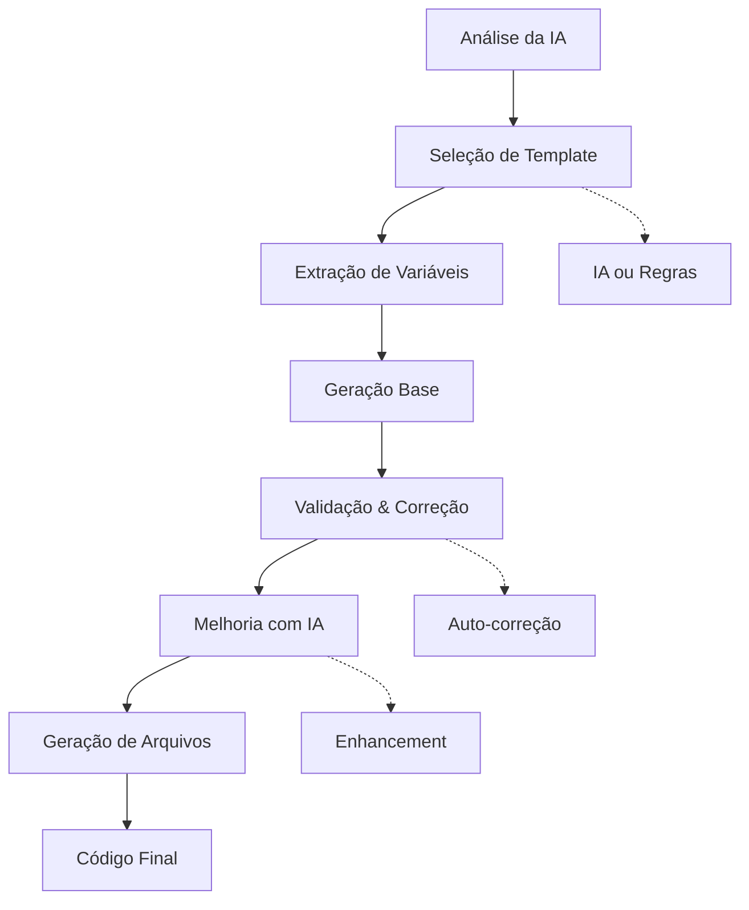

# 🎨 Geradores de Código Inteligentes - Khaos CLI

Sistema de geração de código inteligente que cria componentes seguindo rigorosamente a arquitetura Khaos, utilizando IA para análise, seleção de templates e validação automática.

## 🏗️ Arquitetura dos Geradores

### 📋 Componentes Principais

#### 1. **Template Engine** (`template-engine.ts`)
- Engine EJS customizado com helpers específicos para Khaos
- Transformações de string (kebab-case, PascalCase, camelCase)
- Helpers para geração de imports, props, métodos
- Cache de templates compilados para performance

```typescript
const engine = new TemplateEngine();
const rendered = await engine.render(template, context);
```

#### 2. **Template Selector** (`template-selector.ts`) 
- Seleção inteligente de templates baseada na análise
- Suporte para múltiplos templates por camada
- Seleção por IA ou regras heurísticas
- Registry de templates customizados

```typescript
const selector = new TemplateSelector(registry, aiProvider);
const selection = await selector.selectTemplate(analysis);
```

#### 3. **Variable Extractor** (`variable-extractor.ts`)
- Extração de variáveis da análise para templates
- Geração de contexto completo (nomes, imports, features)
- Aplicação automática de prefixos para features/layouts
- Validação de convenções de nomenclatura

```typescript
const extractor = new VariableExtractor();
const result = await extractor.extractContext(analysis, options);
```

#### 4. **Validation Generator** (`validation-generator.ts`)
- Validação automática do código gerado
- Auto-correção de erros comuns
- Validação específica por camada
- Melhorias com IA quando disponível

```typescript
const validator = new ValidationGenerator(aiProvider);
const code = await validator.generateWithValidation(analysis, context, files);
```

#### 5. **File Generator** (`file-generator.ts`)
- Criação de arquivos e diretórios
- Estrutura automática por camada
- Backup de arquivos existentes
- Preview de estrutura antes da geração

```typescript
const fileGen = new FileGenerator();
await fileGen.generateFiles(context);
```

#### 6. **Code Generator** (`code-generator.ts`)
- Orquestrador principal do sistema
- Fluxo completo de geração
- Integração com todos os componentes
- Logging detalhado do processo

```typescript
const generator = new CodeGenerator(aiProvider);
const result = await generator.generateComponent(analysis);
```

## 🎯 Fluxo de Geração



## 🚀 Uso dos Geradores

### Geração Completa

```typescript
import { createCodeGenerator } from './generators';

// Com IA
const generator = createCodeGenerator(aiProvider);
const result = await generator.generateComponent(analysis, {
  useAIEnhancement: true,
  validateCode: true,
  autoFix: true,
  targetDirectory: './src/components/atoms/button'
});

// Sem IA (apenas templates)
const basicGenerator = createCodeGenerator();
const result = await basicGenerator.generateComponent(analysis);
```

### Preview de Geração

```typescript
const preview = await generator.generatePreview(analysis);
console.log(preview.structure);
console.log('Arquivos:', preview.files);
console.log('Confiança:', preview.confidence);
```

### Geração por Componente

```typescript
// Template Engine
const engine = new TemplateEngine();
engine.registerHelper('customHelper', (context, value) => {
  return `custom-${value}`;
});

// Variable Extractor
const extractor = new VariableExtractor();
const context = await extractor.extractContext(analysis, {
  prefix: 'app',
  features: ['variants', 'stories']
});

// File Generator  
const fileGen = new FileGenerator();
const preview = fileGen.generateFileStructurePreview(fileContext);
```

## 📁 Estrutura de Arquivos por Camada

### Atoms
```
button-atom/
├── button.atom.tsx      # Componente principal
├── button.type.ts       # Tipos e interfaces
├── button.variant.ts    # Variantes CVA (opcional)
├── button.constant.ts   # Constantes (opcional)
├── button.mock.ts       # Mocks (opcional)
├── button.stories.tsx   # Storybook (opcional)
├── button.spec.ts       # Testes (opcional)
└── index.ts            # Exports
```

### Molecules
```
modal-molecule/
├── modal.molecule.tsx   # Componente principal
├── modal.type.ts        # Tipos e interfaces
├── modal.use-case.ts    # Hook de lógica (obrigatório)
├── _services/           # Services (opcional)
└── index.ts            # Exports
```

### Features (com prefixo obrigatório)
```
app-dashboard-feature/
├── app-dashboard.feature.tsx  # Feature principal
├── app-dashboard.type.ts      # Tipos
├── app-dashboard.use-case.ts  # Orquestração
├── _services/                 # Services múltiplos
│   ├── dashboard.service.ts
│   └── analytics.service.ts
└── index.ts                  # Exports
```

## 🎨 Helpers de Template

### Transformações de String
- `toPascalCase()` - ButtonComponent
- `toCamelCase()` - buttonComponent  
- `toKebabCase()` - button-component
- `toConstantCase()` - BUTTON_COMPONENT

### Helpers de Camada
- `layerSuffix()` - .atom, .molecule, etc.
- `hasFeature(feature)` - Verifica se feature está ativada
- `requiresPrefix()` - Verifica se camada requer prefixo

### Helpers de Arquivo
- `componentFileName()` - button.atom.tsx
- `typeFileName()` - button.type.ts  
- `useCaseFileName()` - button.use-case.ts

### Helpers de Geração
- `formatImport(import)` - Formata linha de import
- `generateImports()` - Gera todos os imports
- `generatePropsInterface()` - Gera interface de props
- `generateJSDoc()` - Gera documentação JSDoc

## 🔧 Configuração e Customização

### Templates Customizados

```typescript
const registry = new DefaultTemplateRegistry();
registry.registerTemplate({
  layer: 'atom',
  name: 'icon',
  description: 'Icon atom with SVG support',
  files: [
    {
      name: 'component',
      content: iconTemplate,
      relativePath: 'component.atom.tsx',
      required: true
    }
  ],
  supportedFeatures: ['svg', 'size', 'color']
});
```

### Helpers Customizados

```typescript
const engine = new TemplateEngine();
engine.registerHelper('generateIcon', (context, iconName) => {
  return `<${iconName}Icon />`;
});
```

### Validação Customizada

```typescript
const validator = new ValidationGenerator(aiProvider);
// Validação automática por camada já incluída
```

## 🧪 Testes e Validação

### Validações Automáticas

#### Atoms
- ✅ Presença de `displayName`
- ✅ Suporte a `testID`
- ✅ Estrutura de props correta

#### Molecules/Organisms
- ✅ Import obrigatório do use-case
- ✅ Estrutura de arquivos correta

#### Features
- ✅ Prefixo obrigatório
- ✅ Use-case de orquestração
- ✅ Estrutura de services

### Auto-correções
- 🔧 Adiciona imports React faltantes
- 🔧 Corrige displayName ausente
- 🔧 Adiciona pontos e vírgulas
- 🔧 Remove console.logs

## 📊 Métricas e Qualidade

### Scores de Validação
- **1.0** - Código perfeito, sem issues
- **0.8-0.99** - Pequenos warnings
- **0.5-0.79** - Issues moderados
- **< 0.5** - Requires atenção

### Confiança de Geração
- **0.9-1.0** - Alta confiança
- **0.7-0.89** - Boa confiança  
- **0.5-0.69** - Confiança moderada
- **< 0.5** - Baixa confiança (requires review)

## 🚀 Performance

### Otimizações
- ✅ Cache de templates compilados
- ✅ Reutilização de instâncias
- ✅ Validação paralela de arquivos
- ✅ Lazy loading de providers IA

### Benchmarks
- **Geração básica**: ~100ms
- **Com IA**: ~2-5s (dependendo do provider)
- **Validação**: ~50ms por arquivo
- **Cache hit**: ~10ms

## 🔮 Roadmap Futuro

### Próximas Features
- [ ] Templates visuais (drag & drop)
- [ ] Geração de testes automática
- [ ] Integração com Storybook
- [ ] Suporte a múltiplos frameworks
- [ ] Templates baseados em design system
- [ ] Geração de documentação automática

### Melhorias Planejadas
- [ ] Cache persistente entre sessões
- [ ] Validação em tempo real
- [ ] Suggestions inteligentes
- [ ] Integração com linters externos
- [ ] Suporte a plugins customizados

## 📚 Exemplos de Uso

### Caso 1: Botão com Variantes
```bash
khaos create --smart "um botão reutilizável com variantes de cor e tamanho"
# Gera: button.atom.tsx, button.variant.ts, button.type.ts, etc.
```

### Caso 2: Modal de Confirmação  
```bash
khaos create --smart "modal de confirmação que pode ser usado em várias telas"
# Gera: modal.molecule.tsx, modal.use-case.ts, etc.
```

### Caso 3: Tela de Dashboard
```bash
khaos create --smart "tela de dashboard com métricas e gráficos"
# Gera: app-dashboard.feature.tsx, services/, etc.
```

---

## 🏆 Conformidade Khaos

✅ **100% conformidade** com arquitetura Khaos  
✅ **Validação automática** de convenções  
✅ **Estrutura consistente** entre camadas  
✅ **Performance otimizada** para desenvolvimento  
✅ **Extensibilidade** via plugins e customizações  

Este sistema de geradores representa o estado da arte em geração de código inteligente para React/TypeScript, proporcionando desenvolvedores com uma ferramenta poderosa que mantém qualidade e consistência enquanto acelera drasticamente o desenvolvimento. 